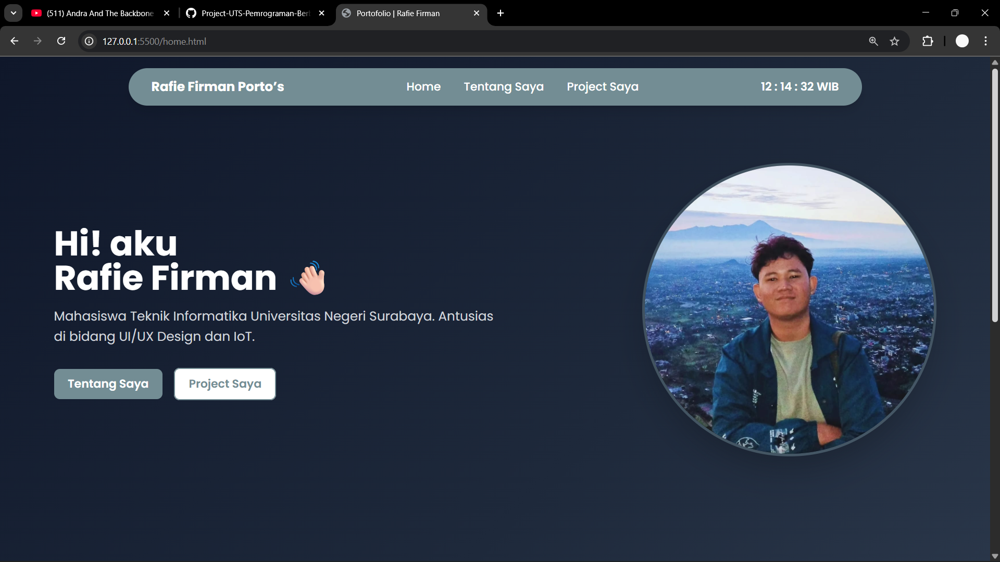
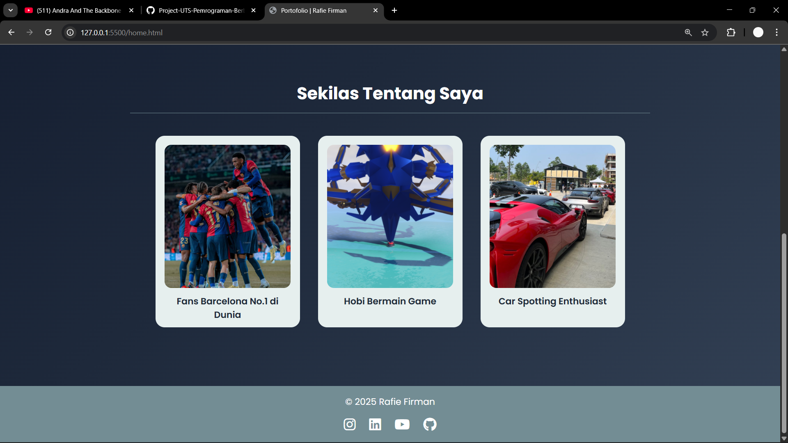
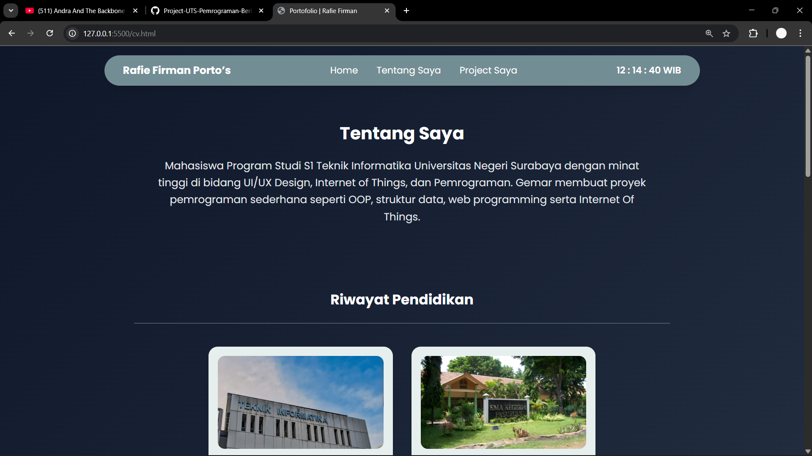
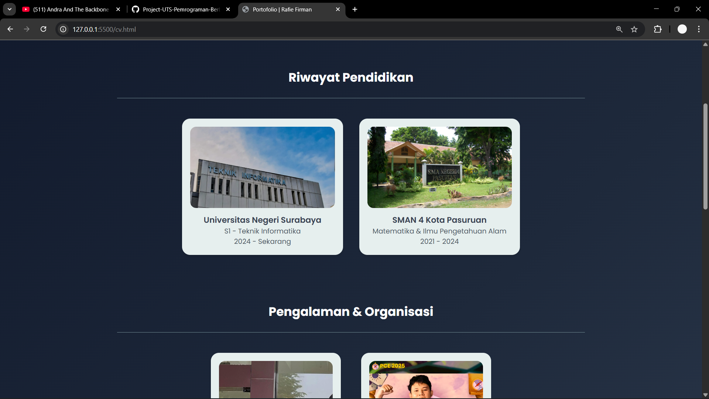
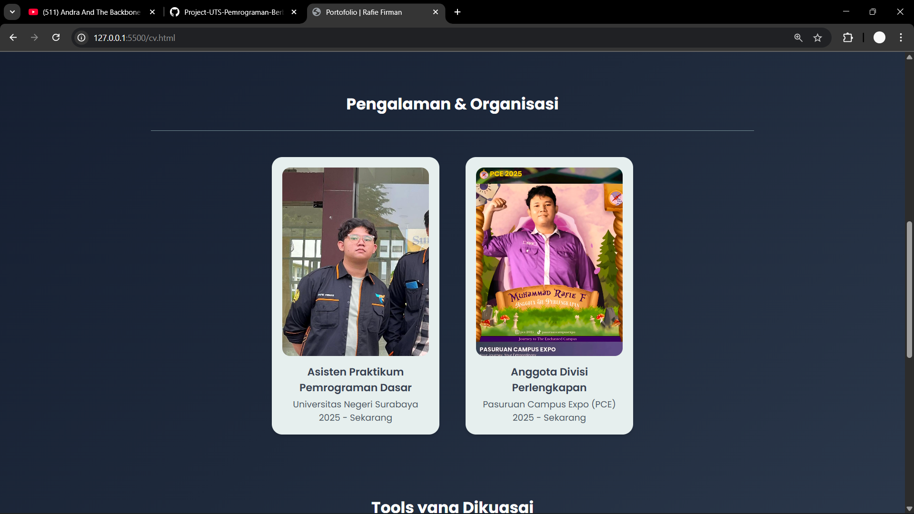
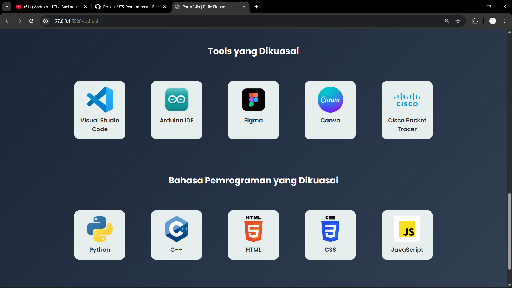
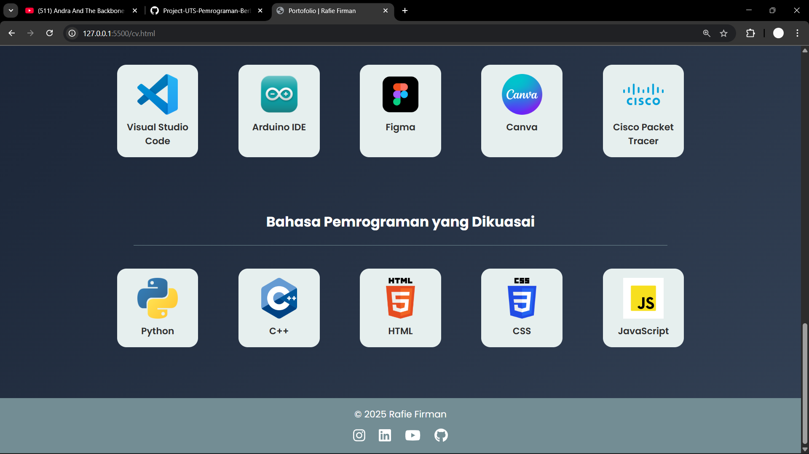
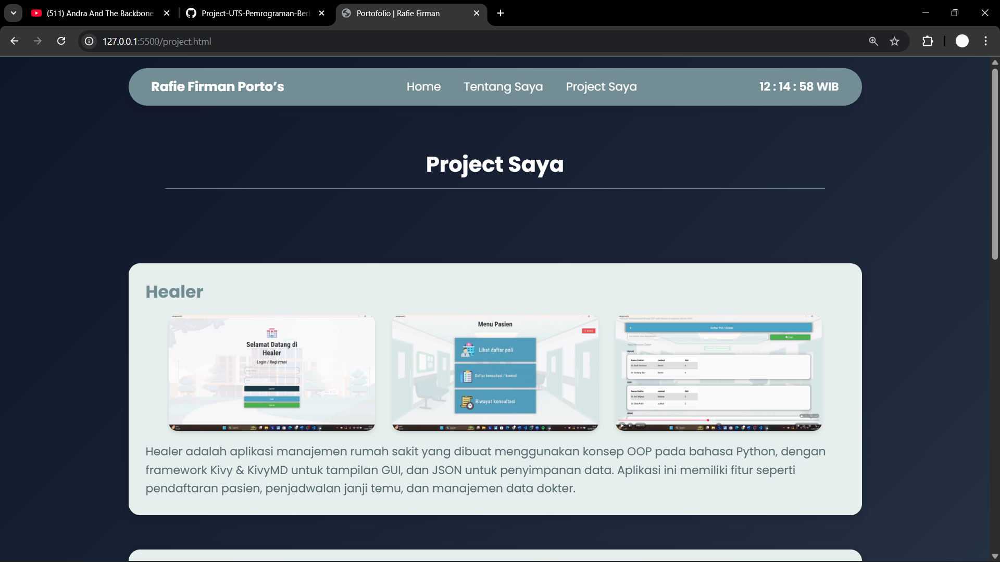
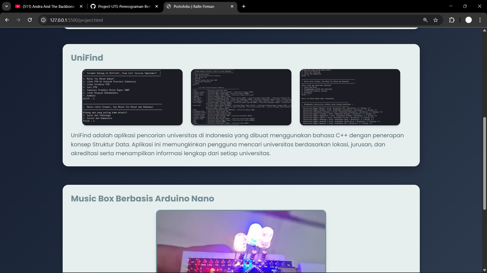
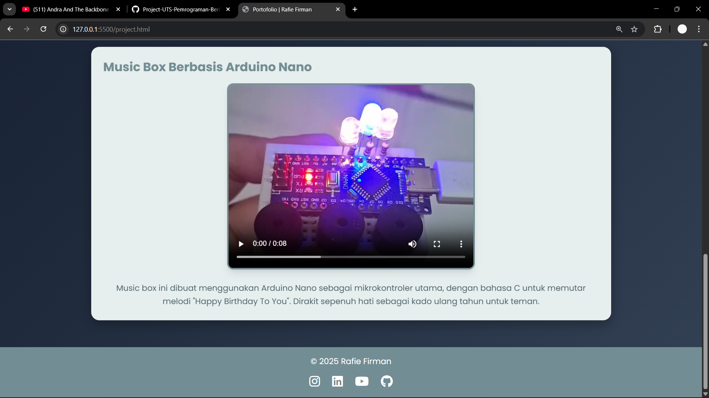

# Project-UTS-Pemrograman-Berbasis-Platform
Muhammad Rafie Firman Rusidy
TI 2024B
24051204065

Website portofolio yang saya buat ini merupakan hasil dari pekerjaan yang ditujukan untuk memenuhi
Penugasan Ujian Tengah Semester mata kuliah Pemrograman Berbasis Platform, yang diampu oleh
Bapak Rifqi Abdillah, S.Tr.T., M.Kom.

Web ini berisikan 3 halaman utama,
- Halaman 1 "Home Page",
- Halaman 2 "Tentang Saya" berisikan informasi pribadi, riwayat pendidikan serta pengalaman organisasi,
- Halaman 3 "Project saya" berisikan project=project yang pernah saya buat.

Dibuat dengan :
- HTML Sebagai struktur utama halaman
- CSS native untuk styling header, footer, dan card
- Tailwind CSS CDN sebagai template layout serta komponen responsif
- Javascript menampilkan jam real-time dan animasi interaktif

Fitur Utama
- Navbar oval dengan jam real-time
- Halaman CV dengan riwayat pendidikan, pengalaman, dan skill
- Tampilan proyek dengan deskripsi
- Desain yang kompatibel dengan berbagai perangkat

[Video Presentasi]([https://youtu.be/9NXlGtXbJGY])

Tampilan website:

